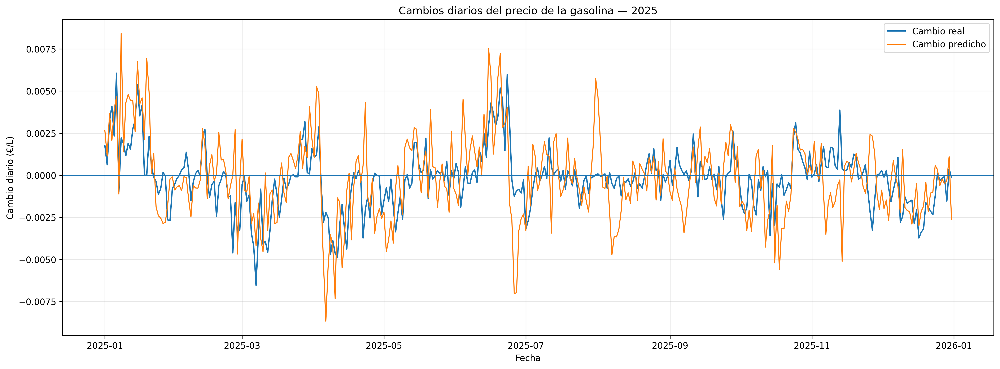
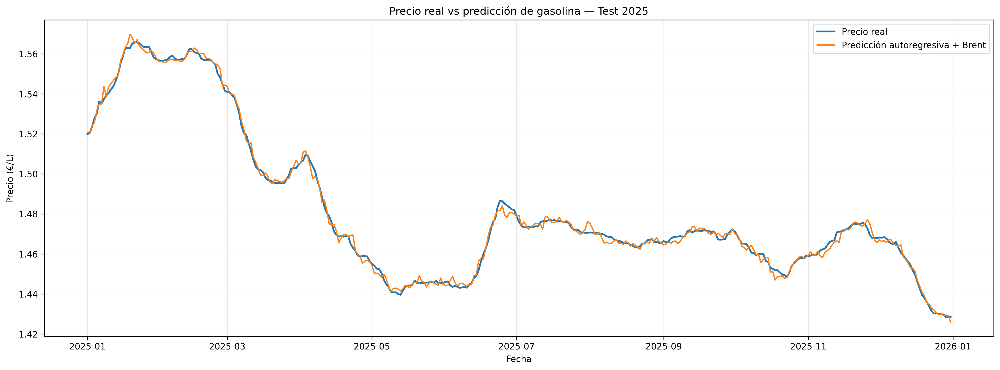

# Gasolina Price Forecast

## 📌 Descripción

Proyecto de análisis y predicción del precio de la gasolina en España utilizando datos históricos del precio minorista y variables del mercado energético.

El objetivo es estudiar hasta qué punto el comportamiento histórico del precio de la gasolina y variables como el precio del Brent y el tipo de cambio EUR/USD permiten anticipar el precio del día siguiente.

La pregunta principal del proyecto es:

> ¿Hasta qué punto podemos anticipar el precio de la gasolina del día siguiente utilizando su comportamiento histórico y variables del mercado energético?

---

## 🎯 Objetivos

* Analizar la evolución histórica del precio de la gasolina.
* Estudiar la relación entre el precio de la gasolina y el Brent.
* Incorporar el tipo de cambio EUR/USD para convertir el Brent a euros.
* Crear variables temporales y retardos (lags).
* Construir un modelo de referencia basado en variables del Brent.
* Construir un modelo autoregresivo incorporando el comportamiento histórico de la gasolina.
* Comparar los modelos con un baseline sencillo.
* Evaluar el rendimiento sobre un periodo temporal no utilizado durante el entrenamiento.

---

## 📊 Datos

El conjunto de datos contiene información diaria entre enero de 2016 y septiembre de 2026.

Variables principales utilizadas:

* `fecha`
* `pvp_eur_litro`
* `brent_usd_barril`
* `eurusd`
* `brent_eur_barril`

A partir de estas variables se generaron diferentes características:

* Retardos del Brent: 1, 3 y 7 días.
* Cambios del Brent a 1 y 7 días.
* Retardos del precio de la gasolina: 1, 2, 3 y 7 días.
* Mes.
* Día de la semana.
* Días desde el inicio de la serie.

---

## 🧠 Metodología

Se utilizó una división temporal de los datos para evitar utilizar información futura durante el entrenamiento.

### Validación

Se utilizaron los datos anteriores a 2024 para entrenar y 2024 como periodo de validación.

### Test final

Posteriormente, el modelo se volvió a entrenar utilizando los datos anteriores a 2025 y se evaluó sobre todo 2025.

De esta forma, el modelo no utiliza datos de 2025 para entrenarse antes de realizar las predicciones de ese año.

---

## 📈 Modelos

### 1. Modelo de referencia basado en Brent

Este modelo utiliza información histórica del Brent y variables temporales para intentar anticipar el precio de la gasolina del día siguiente.

Resultados sobre 2025:

| Métrica |    Resultado |
| ------- | -----------: |
| MAE     | 0.026943 €/L |
| RMSE    | 0.033380 €/L |
| R²      |     0.173719 |

El resultado muestra que las variables relacionadas con el Brent aportan información sobre el comportamiento del precio, pero no son suficientes por sí solas para obtener una predicción precisa del precio minorista diario.

---

### 2. Modelo autoregresivo + Brent

Se incorporaron retardos del propio precio de la gasolina junto con variables relacionadas con el Brent y variables temporales.

Resultados sobre 2025:

| Métrica |    Resultado |
| ------- | -----------: |
| MAE     | 0.001581 €/L |
| RMSE    | 0.002060 €/L |
| R²      |     0.996853 |

El modelo consigue errores absolutos muy reducidos en el precio diario.

Sin embargo, un R² elevado no debe interpretarse como un 99,7 % de precisión. El precio de la gasolina presenta una elevada persistencia temporal, por lo que conocer el precio del día anterior ya permite aproximar bastante bien el precio del día siguiente.

---

### 3. Baseline naive

Para comprobar si la complejidad del modelo realmente aporta valor, se utilizó una referencia muy sencilla:

> Predecir mañana utilizando como predicción el precio conocido de hoy.

Resultados sobre 2025:

| Modelo                | MAE (€/L) | RMSE (€/L) |       R² |
| --------------------- | --------: | ---------: | -------: |
| Naive: precio de hoy  |  0.001242 |   0.001788 | 0.997628 |
| Autoregresivo + Brent |  0.001581 |   0.002060 | 0.996853 |

El baseline obtiene menores errores MAE y RMSE.

Este resultado es relevante porque demuestra que un modelo más complejo no necesariamente mejora una predicción sencilla cuando la variable objetivo presenta una fuerte persistencia temporal.

---

## 📉 Análisis de los cambios diarios

Además del análisis del precio absoluto, se estudiaron los cambios diarios para comprobar cómo responde el modelo ante las variaciones de la serie.

La precisión en la dirección del cambio diario fue del:

**67,95 %**

La correlación entre los cambios reales y los cambios predichos fue:

**0,5689**

Este análisis proporciona una visión diferente del rendimiento, ya que el R² del precio absoluto está muy condicionado por la persistencia de la serie.



---

## 📊 Precio real vs predicción

También se comparó directamente el precio real con la predicción durante 2025.



Esta visualización permite observar la evolución conjunta de ambas series.

---

## 🌍 Brent y precio de la gasolina

El Brent se utilizó como variable económica de referencia debido a su relación con el mercado internacional del petróleo.

Sin embargo, el precio minorista de la gasolina no depende exclusivamente del petróleo.

También intervienen factores como:

* Tipo de cambio EUR/USD.
* Costes de refino.
* Impuestos.
* Transporte y distribución.
* Márgenes comerciales.
* Situación del mercado energético.
* Cambios extraordinarios en la oferta y la demanda.

Por este motivo, una relación directa entre Brent y precio final de la gasolina no debe interpretarse como una relación causal completa.

---

## ⚠️ Periodos extraordinarios

El conjunto de datos incluye periodos con importantes alteraciones del mercado energético, como la pandemia de COVID-19 y los cambios asociados a la guerra de Ucrania y otros acontecimientos geopolíticos.

Estos periodos no fueron eliminados del análisis.

Sin embargo, el modelo predictivo no identifica de forma explícita el efecto causal de cada acontecimiento.

Para estimar cuál habría sido el precio de la gasolina en un escenario hipotético sin estos acontecimientos sería necesario realizar un análisis contrafactual específico.

---

## 🔎 Principales conclusiones

1. El precio de la gasolina presenta una elevada persistencia temporal.
2. El Brent aporta información económica relevante, pero por sí solo tiene una capacidad limitada para anticipar el precio minorista diario.
3. Incorporar retardos del precio de la gasolina mejora enormemente la capacidad de predecir el nivel de precios.
4. El modelo autoregresivo obtiene un R² de 0.996853 sobre 2025.
5. Sin embargo, el baseline naive obtiene mejores valores de MAE y RMSE.
6. Esto demuestra la importancia de comparar modelos complejos con referencias sencillas.
7. La predicción de la dirección diaria alcanzó un 67,95 %.
8. El resultado muestra que un modelo aparentemente muy preciso sobre el nivel de precios no implica necesariamente que pueda anticipar perfectamente los movimientos diarios.

---

## 🛠️ Tecnologías utilizadas

* Python
* Pandas
* NumPy
* Matplotlib
* Scikit-learn
* Jupyter Notebook
* SQL
* Series temporales
* Machine Learning
* Regresión lineal

---

## 📁 Estructura del proyecto

```text
gasolina-price-forecast/
│
├── README.md
├── gasolina_forecast_final.ipynb
│
├── images/
│   ├── cambios_diarios_2025.png
│   └── precio_real_vs_prediccion_2025.png
│
└── data/
    └── README.md
```

---
